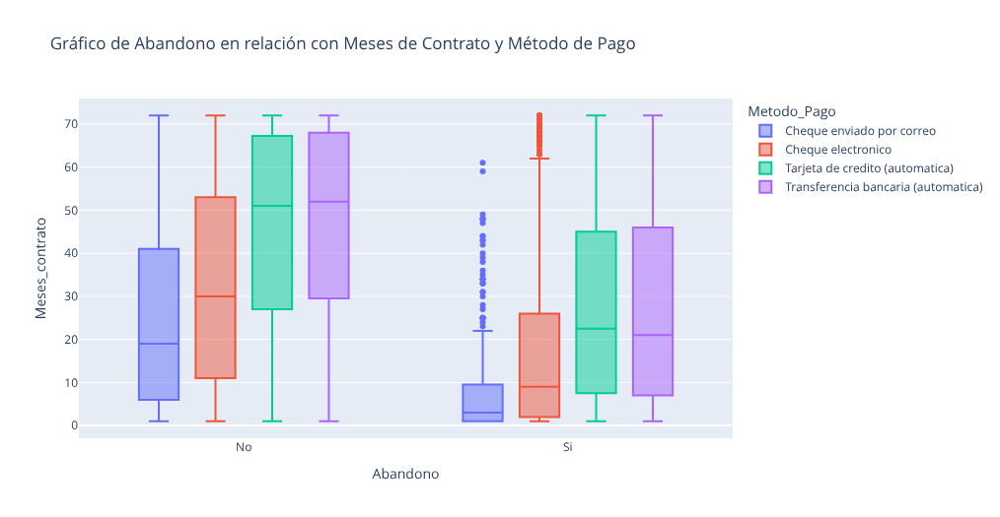
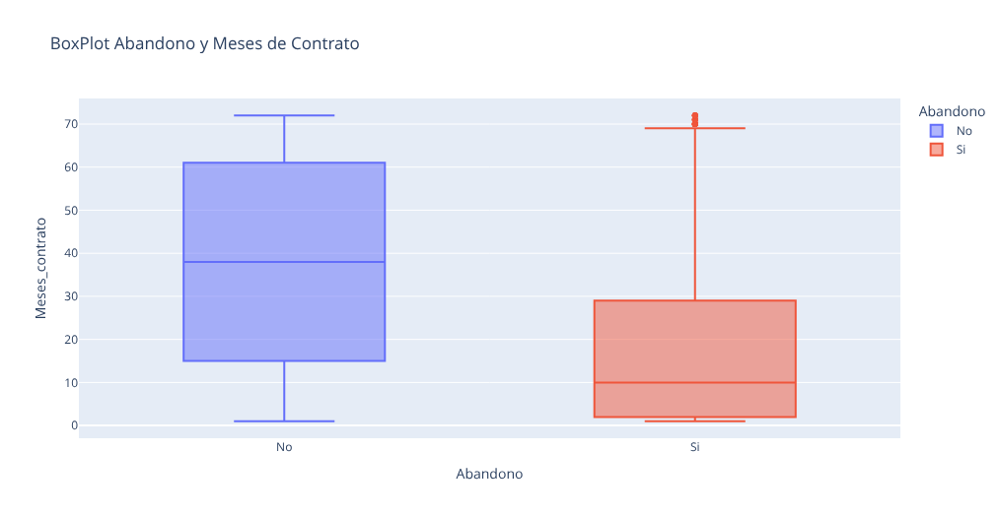
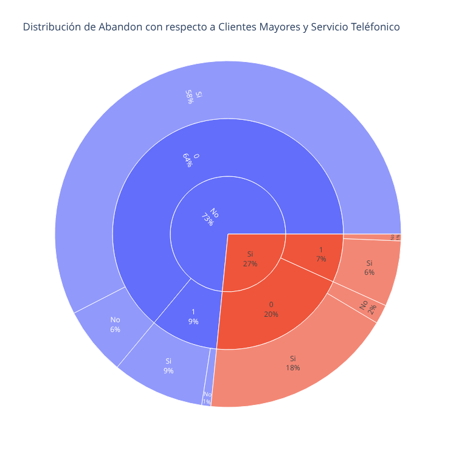

# 📊 Análisis de Deserción de Clientes en Telecom (Parte 1)


## 📌 Descripción y Objetivo del Proyecto
En la industria, el **Análisis de Evasión** (conocido en inglés como *Churn Analysis*) es un estudio estratégico utilizado para identificar y predecir qué clientes tienen probabilidades de cancelar su servicio o dejar de adquirirlos de una empresa. Este proyecto analiza un conjunto de datos de una compañía que brinda servicios de internet, teléfonico, etc., para identificar patrones de comportamiento en los clientes que abandonan el servicio (**Churn**). 

## ❓ Problemática
La empresa enfrenta una pérdida constante de usuarios y desconoce las causas raíz. A través del análisis exploratorio de datos (EDA), se busca responder a las siguientes preguntas clave de negocio:
1.  **Compromiso:** ¿Qué tipos de contratos presentan el mayor riesgo de fuga?
2.  **Ciclo de Vida:** ¿En qué etapa (meses de antigüedad) ocurre la mayor cantidad de abandonos?
3.  **Transacciones:** ¿Existe una relación directa entre los métodos de pago y la tasa de retención?


## 🛠️ Tecnologías Utilizadas
* **Python:** Lenguaje principal para el análisis.
* **Pandas:** Limpieza y manipulación de datos (ETL).
* **Plotly Express:** Visualizaciones interactivas (Sunburst, Boxplots).
* **Seaborn & Matplotlib:** Gráficos estadísticos estáticos y mapas de calor (Heatmaps).

## 📂 Estructura del Proyecto

```text
📁 Chagenge-Telecom-2026/
│
├── images                           # Imágenes de graficos en formato .png
├── TelecomX_LATAM.ipynb             # Notebook principal con análisis y gráficos
└── README.md                        # Documentación del proyecto
```
## ▶️ Cómo Ejecutar el Proyecto

🔹Abrir Google Colab

🔹Subir el archivo .ipynb

🔹Ejecutar todas las celdas (Runtime > Run all).

Nota: El dataset se carga directamente dentro del notebook.

## 🔍 Análisis y Hallazgos Clave

| Variable | Tipo | Descripción |
| :--- | :--- | :--- |
| **Churn** | *Target* | Variable objetivo. Indica si el cliente se fue (`Yes`) o se quedó (`No`). |
| **Tenure** | *Numérica* | Cantidad de meses que el cliente lleva en la compañía. |
| **Contract** | *Categórica* | Tipo de contrato (Month-to-month, One year, Two year). |
| **PaymentMethod** | *Categórica* | Cómo paga (Electronic check, Mailed check, Transfer, Credit card). |

Hallazgos:

1. La Influencia del Tipo de Contrato

2. La "Zona de Peligro" (Antigüedad)

3. El Efecto "Adherencia" (Fidelidad de los usuarios)

---

## 📊 Gráficos Realizados:

<p align="center">
  
  <br>
  <i><b>Figura 1:</b> Distribución de abandono según el método de Pago y meses de contrato.</i>
</p>


<p align="center">
  
  <br>
  <i><b>Figura 2:</b> Distribución de abandono según los meses de contrato.</i>
</p>

<p align="center">
  
  <br>
  <i><b>Figura 3:</b> Distribución de abandono según si es Cliente de 65 y Servicios.</i>
</p>

## 📝 Conclusión Personal:

A modo de cierre personal, este proyecto demuestra que el Análisis de Datos no se trata simplemente de crear visualizaciones estéticas, sino de traducir filas y columnas.

Sobre lo que aprendí trabajando con este dataset. Al principio, imaginaba que el abandono del servicio iba a depender mucho del perfil de la persona (si eran jóvenes, mayores, hombres o mujeres). Sin embargo, los datos me demostraron un punto de vista totalmente distinto: el problema no es el cliente, es cómo está diseñado el servicio.

A modo de resumen, los gráficos nos mostraron tres grandes verdades:

    1.  Los contratos "Mes a Mes" son una puerta de salida gigante.

    2.  Los primeros 10 meses son la prueba de fuego; si el cliente pasa de ese tiempo, es muy raro que se vaya.

    3.  Hay un problema grave (y no muy evidente) con la gente que paga por Cheque Electrónico.

Viendo esto desde una perspectiva de resolución de problemas, la empresa tiene un fallo lógico en su sistema de ventas. Si a un usuario le vendes un solo servicio básico y no le pides ningún compromiso de tiempo, a la primera falla que tenga se va a ir con la competencia porque no le cuesta nada hacerlo.

En definitiva, este proyecto me enseñó que analizar datos sirve exactamente para esto: para dejar de echarle la culpa a x factores y encontrar dónde está fallando realmente nuestro proceso para poder arreglarlo.

---
## 👩‍💻 Autora
Ayelén (Angie) Desarrolladora en formación — Programa Alura Latam 2025

## ⭐ Contribuciones
Las contribuciones son bienvenidas. Si deseas mejorar gráficos, optimizar código o agregar nuevos análisis, puedes abrir un issue o un pull request.

## 🎓 Agradecimientos y Créditos
Este análisis es el resultado del segundo desafío técnico del programa Oracle Next Education. Agradezco a Alura Latam por la formación brindada en "Aprendiendo a hacer ETL G9-ONE".
